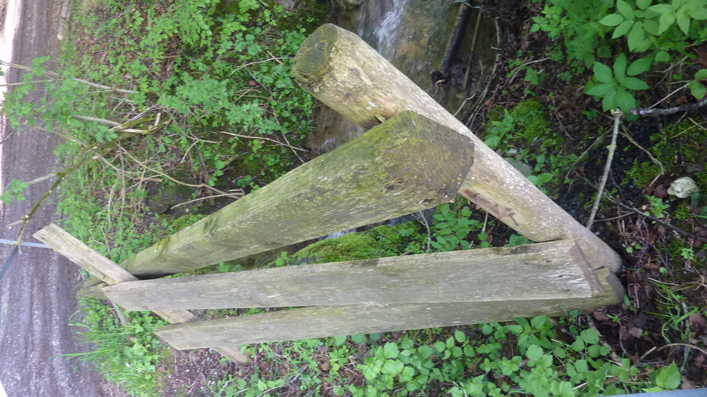

Bridge siding
===

Design
---

### 3D model and calculations.

### Construction:
#### Old siding:
The old one was nice, more rigid and somehow broken.

#### New siding:
The new one looks not rigid enough, yet it somehow holds. No 3D printer yet, therefore no Ancient Roman or cows or other animals. The metal construction is as easy and using as few metal as possible. No fancy decoration unfortunately.

To make it disappear a bit to disrupt nature less, it's been painted black (first thought of a dark green), hopefully the squirrels and other animals aren't too angry:

